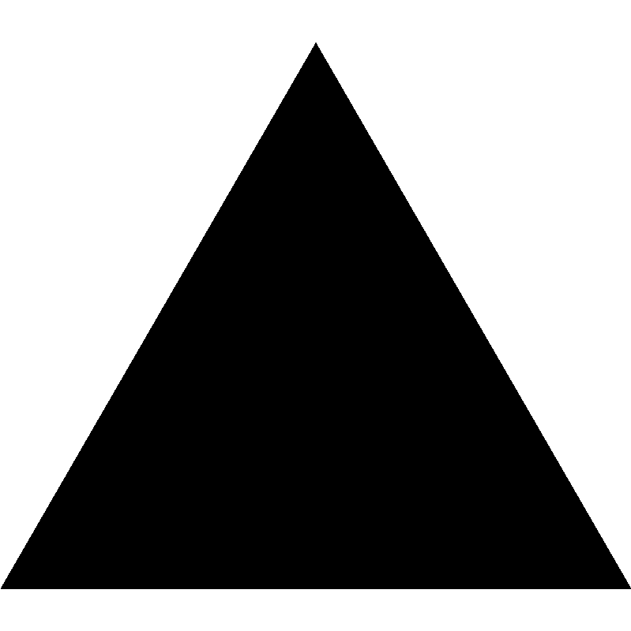
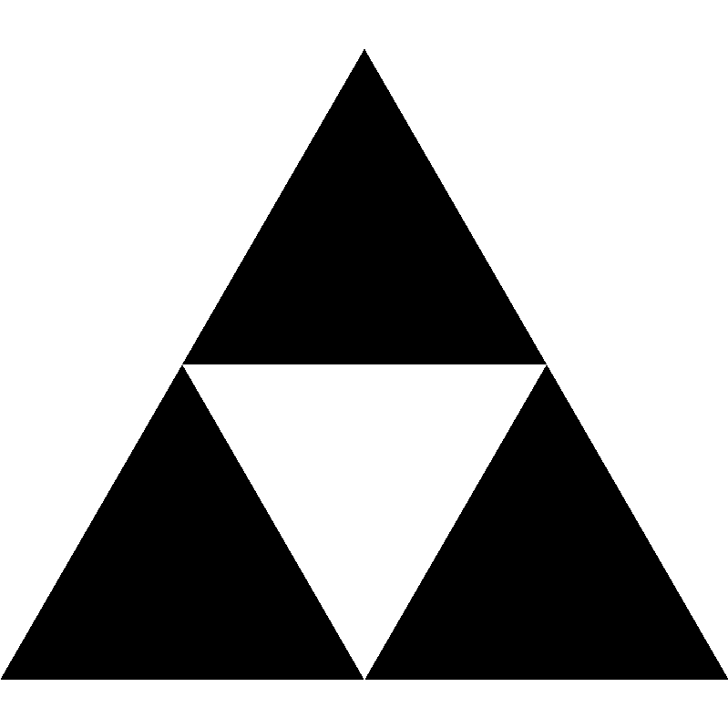
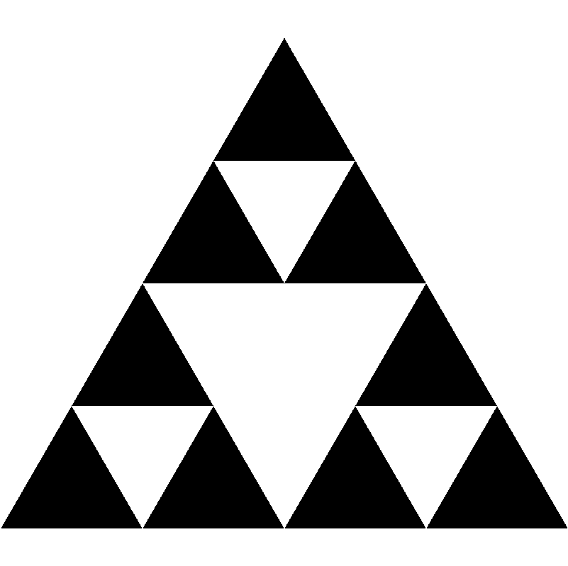
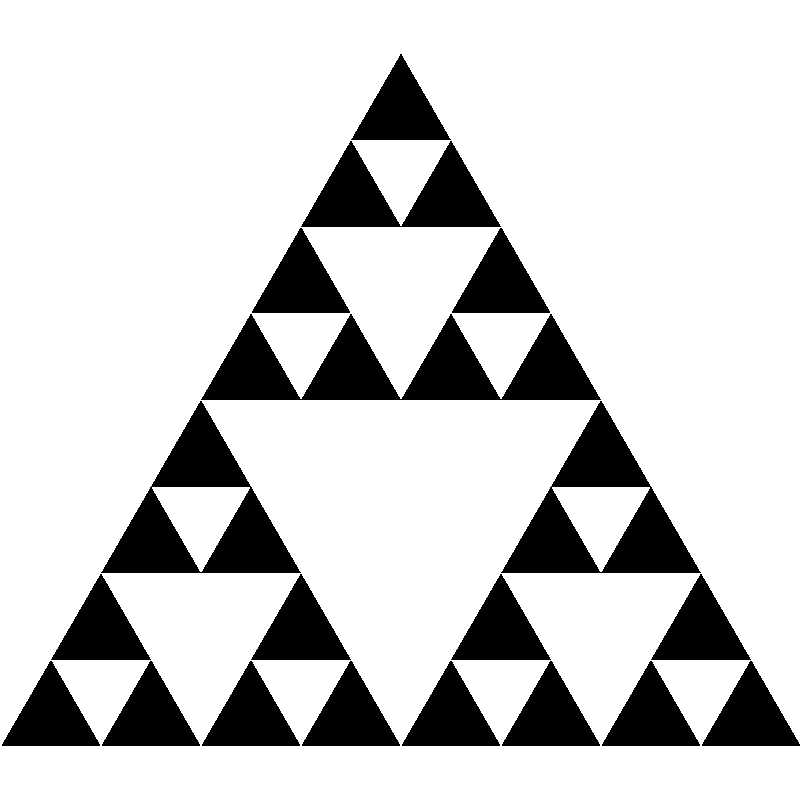
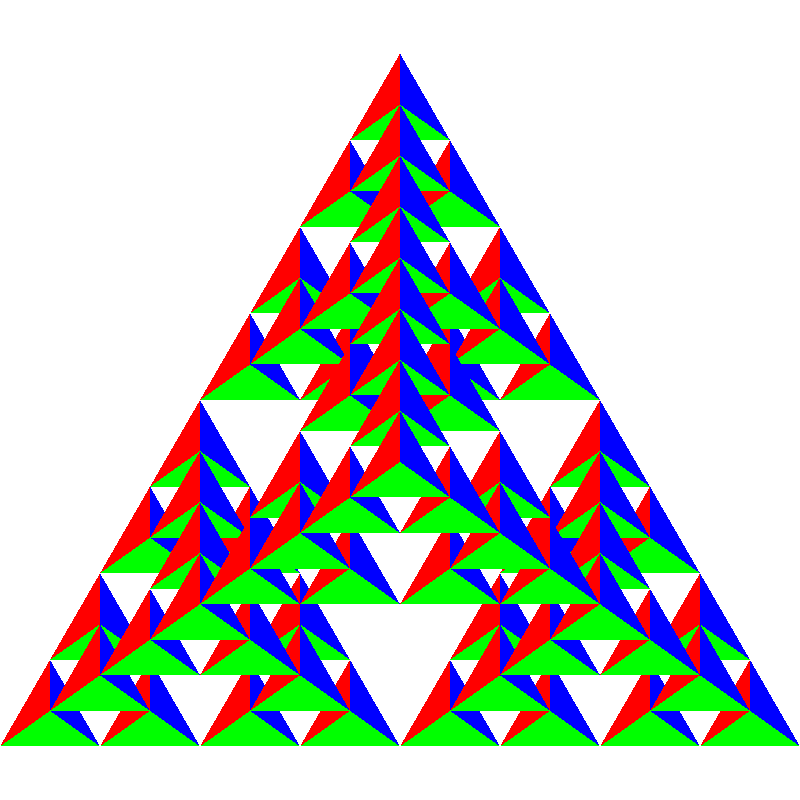

# Exercise 04

Deadline: 2022-12-01 10:00

## 1. Written

**Please** write your solutions into `SOLUTION.md`. You can use mathematical expression in markdown using Latex syntax, by writing in beetween the dollar expressions ``$` `` and `` `$`` or within code blocks using `math`. These will be rendered in  _Gitlab_ using `KaTeX`:

````markdown
This math is inline $`a^2+b^2=c^2`$.

This is on a separate line

```math
a^2+b^2=c^2
```
````
ergibt:

This math is inline $`a^2+b^2=c^2`$.

This is on a separate line

```math
a^2+b^2=c^2
```

### 1.1. Sierpiński-Triangles

The following picture shows the first four members of the sequence $`T_0,T_1,...`$ of the Sierpiński-Triangles.
Starting with an **equal-sided triangle** $`T_0`$ with area $`A`$, $`T_1`$ is created from $`T_0`$ by decomposing $`T_0`$ into four equal-sided triangles with identical areas as shown, and _"deleting"_ the middle triangle (represented by the white area).
For the three remaining triangles (top, bottom left and bottom right) this process is repeated recursively.

| $`T_0`$                     | $`T_1`$                     | $`T_2`$                     | $`T_3`$                     |
| --------------------------- | --------------------------- | --------------------------- | --------------------------- |
|   |   |   |   |


Let $`A_n`$ be the area of the $`n`$-th Sierpiński-Triangle $`T_n`$ - the white triangles therefore do not enter the area.
1. Establish a recurrence equation for $`A_n`$. (2 point)
2. Show by complete induction that $`A_n = (\frac{3}{4})^n \cdot A`$ holds. (2 point)
3. What happens in the limit for $`n \rightarrow \infty`$? Determine $` \lim \limits_{n \to \infty} A_n`$. (1 points)


## 2. Programmieren
You will find in `main.cpp` the C++ code to render a **2D** Sierpiński triangle in **OpenGL**. Convert this so that a **3D** view is created. A description of the procedure can be found in the book in section 2.10 ("The three-dimensional gasket"). (5 points)
**Note** the following points:

1. Start by converting the vertices to `glm::vec3`. Instead of the points given in the book, use the following outer points for the tetrahedron:
    ```
    std::vector<glm::vec3> vertices = { glm::vec3(0.f, -0.1547f, -1.f),
                                        glm::vec3(0.f, 0.866f, 1.f),
                                        glm::vec3(-1.f, -0.866f, 1.f),
                                        glm::vec3(1.f, -0.866f, 1.f) };
    ```
    You should have two `std::vector<glm::vec3>`, one for point locations and one for colors.

2.  Create the function
    ```
    void triangle(std::vector<glm::vec3>& points, std::vector<glm::vec3>& colors,
              glm::vec3 a, glm::vec3 b, glm::vec3 c, size_t color_index)
    ```
    which creates a triangle from the points `a`, `b`, `c` in 3D and stores it in `points`. Analogously, the color is to be set by assigning the `base_color` with the index `color_index` to each point in `colors`. Thereby -- different from JavaScript -- the points and colors have to be pushed into the corresponding containers using `std::vector::push_back()`!
2.  Create the function
    ```
    void tetra(std::vector<glm::vec3>& points, std::vector<glm::vec3>& colors,
           glm::vec3 a, glm::vec3 b, glm::vec3 c, glm::vec3 d)
    ```
    which creates four triangles from the given four points by calling `triangle()` accordingly.
3. Create the function
    ```
    void divide_tetra(std::vector<glm::vec3>& points,
                  std::vector<glm::vec3>& colors, glm::vec3 a, glm::vec3 b,
                  glm::vec3 c, glm::vec3 d, unsigned int count)
    ```
    which, analogous to the book, recursively splits a tetrahedron.
4. Finally, `main()` and the _vertex shader_ must be adjusted to display the calculated points.
    * Add a variable `in vec3 in_color;` to the vertex shader and use it to set the output color.
    * Make sure in your `glBufferData` call you use the correct size for the points you are now passing (vec3 instead of vec2)
    * Create a `cg::Buffer buffer_color` ad call `glBindBuffer` and `glBufferData` analog to the way the position buffer is created. Use this to pass color information to the shader.
    * Use `glGetAttribLocation`, `glVertexAttribPointer` and `glEnableVertexAttribArray` to get access to `in_color`, analog to `in_position`.

The following result should be created after three steps of subdivision:




Total: 10 Points
